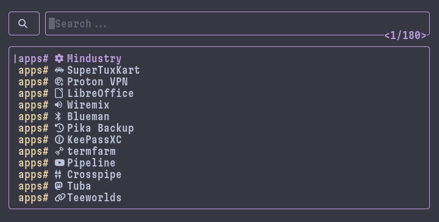

# spyglass



[](https://deepwiki.com/indium114/spyglass)

**spyglass** is an extensible TUI search tool written in *Rust*, inspired by [fsel](https://github.com/mjoyufull/fsel), [Raycast](https://raycast.com) and [Vicinae](https://vicinae.com)

## Installation

### with Nix

Simply add the repo to your flake inputs...

```nix
inputs = {
  spyglass = {
    url = "github:indium114/spyglass";
    inputs.nixpkgs.follows = "nixpkgs";
  }
};
```

...and pass it into your `environment.systemPackages`...

```nix
environment.systemPackages = [
  inputs.spyglass.packages.${pkgs.stdenv.hostPlatform.system}.spyglass
];
```

### with Cargo

Simply run the following command:

```shell
cargo install spyglass
```

> [!NOTE]
> Ensure that `~/.cargo/bin` is in your $PATH

## Basic Navigation

- `Type` to search
- Use `Up/Down` to select results
- Search a specific lens with `lensname#`
  - e.g. `apps#` for apps

## Documentation

For instructions on how to configure the default `Applications` lens, how to register new lenses, and how to create your own lens, see the [documentation home](/docs/home.md)
